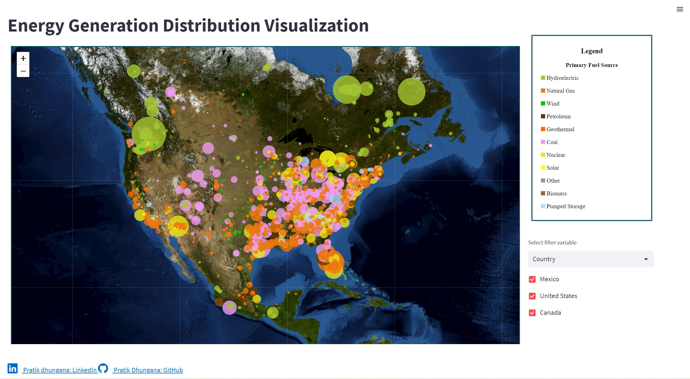

### Fuel Types for Electricity Generation in North America
This is an interactive web application created using `streamlit`, which lets a user filter data based on `country`, `fuel type` and `renewable fuel type`.
This was created using the following steps:
1. From ArcGIS REST API, data was queried to obtain [Power Plants, 100 MW or more](https://geoappext.nrcan.gc.ca/arcgis/rest/services/NACEI/energy_infrastructure_of_north_america_en/MapServer/15) data in geojson format using `requests` library.
2. Data was read as geodataframe using `geopandas`.
3. A `folium` basemap was created with [USGS US Imagery tiles](https://basemap.nationalmap.gov/arcgis/rest/services/USGSImageryOnly/MapServer/tile/{z}/{y}/{x}).
4. A `streamlit` application with a dropdown for selecting filter variables, checkboxes to filter data based on the filter variables was created.
5. The filtering was applied using `geopandas` and each point after filtering was added to the map as circle marker with appropriate color, size and popup. This filtering is updated each time the filter variable or checkboxes change.

__View app live at [streamlit cloud](https://pratik-tan10-energy-visualization-filter-map-yl3q7a.streamlit.app/)__

<figure>
  

  <figcaption>Figure 1: Web application overview.</figcaption>
</figure>

Connect with me on [LinkedIn](https://www.linkedin.com/in/pratikdh/).

This is inspired from the [Try the Filter Widget in ArcGIS Experience Builder (esri.com)](https://www.esri.com/arcgis-blog/products/experience-builder/mapping/try-the-filter-widget/) by [Thomas Coughlin](https://www.esri.com/arcgis-blog/author/tcoughlin-2/).
